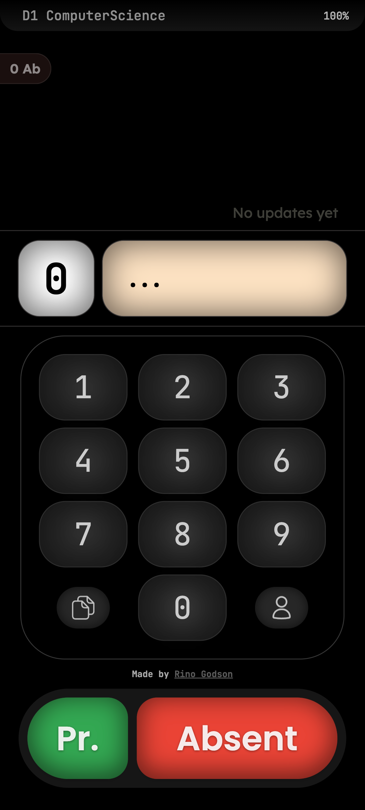

# Rosterio

> Generate Whatsapp supported Attendance Reports. Lightning fast attendance reports!!


## Installation
You just need to clone this repo and run `npm install` and `npm start` to start the app.
It is a PWA so you can install it on your device and use it offline (after deployment).

**Note:** `src/dataSource/divisionList.json` file must be made to store the details of your class.
### JSON Schema:
```json
{
"name": "Your Class Name Here",
"list": [
  {
    "no": 1,
    "name": "Student 1 Name"
  },
  {
    "no": 2,
    "name": "Student 2 Name"
  },
  {
    "no": 3,
    "name": "Student 3 Name"
  },
  {
    "no": 4,
    "name": "Student 4 Name"
  }
  // continues
]
}

```

## Usage


Like a keypad, you can type or click on the keys to mark your presence or absence.
Once you are done, click on the `List` button to see the attendance list.
Once you are sure about the list, click the `copy` button to copy the report to your clipboard.

You can also generate presentees or absentees list by clicking on the `Presentees` or `Absentees` button on the top left corner.
